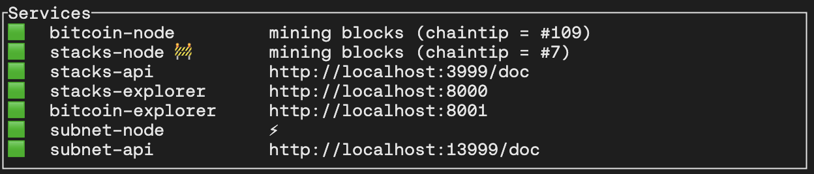

---
# The default id is the same as the one defined below. so not needed
title: Getting Started
---

# Getting Started

Developers can test their applications on a subnet either locally or on Hiro's
hosted testnet subnet. This page describes two different walkthroughs that
illustrate how to use a subnet.

- Run a local subnet
- Use Hiro's subnet on testnet

:::note

A subnet was previously referred to as a hyperchain. While the process of updating the content is ongoing, there may still be some references to a
hyperchain instead of a subnet.

:::


## Run a local subnet

Clarinet provides a tool to set up a complete local development environment, referred to as "devnet," which uses Docker to spin up a Bitcoin node, a Stacks node, a Stacks API node, a Stacks Explorer, and now, a subnet node and subnet API node. This allows developers to test locally on a system that matches the production environment.

In this section, we will explain how to launch and interact with this devnet
subnet environment using a simple NFT example project.

Ensure you have `clarinet` installed and the version is 1.5.3 or
above. If you do not already have clarinet installed, please refer to the
clarinet installation instructions
[here](https://docs.hiro.so/smart-contracts/clarinet#installing-clarinet) for
installation procedures.

### Create a new project with Clarinet

To create a new project, run:

```sh
clarinet new subnet-nft-example
cd subnet-nft-example
```

This command creates a new directory with a clarinet project already
initialized, and then switches into that directory.

### Create the contracts

The clarinet does not yet support deploying a contract to a subnet, so we will not use it to manage our subnet contracts in this guide. Instead, we will manually deploy our subnet contracts for now.

#### Creating the Stacks (L1) contract

Our L1 NFT contract is going to implement the
[SIP-009 NFT trait](https://github.com/stacksgov/sips/blob/main/sips/sip-009/sip-009-nft-standard.md#trait).

We will add this to our project as a requirement so that Clarinet will deploy it
for us.

```sh
clarinet requirements add ST1NXBK3K5YYMD6FD41MVNP3JS1GABZ8TRVX023PT.nft-trait
```

We'll also use a new trait defined for the subnet, `mint-from-subnet-trait,`
that allows the subnet to mint a new asset on the Stacks chain if it was
originally minted on the subnet and then withdrawn. We will add a requirement
for this contract as well:

```sh
clarinet requirements add ST1PQHQKV0RJXZFY1DGX8MNSNYVE3VGZJSRTPGZGM.subnet-traits
```

Now, we will use Clarinet to create our L1 contract:

```sh
clarinet contract new simple-nft-l1
```

This creates the file, _./contracts/simple-nft-l1.clar_, which will include the
following clarity code:

```clarity
(define-constant CONTRACT_OWNER tx-sender)
(define-constant CONTRACT_ADDRESS (as-contract tx-sender))

(define-constant ERR_NOT_AUTHORIZED (err u1001))

(impl-trait 'ST1NXBK3K5YYMD6FD41MVNP3JS1GABZ8TRVX023PT.nft-trait.nft-trait)
(impl-trait 'ST1PQHQKV0RJXZFY1DGX8MNSNYVE3VGZJSRTPGZGM.subnet-traits.mint-from-subnet-trait)

(define-data-var lastId uint u0)
(define-map CFG_BASE_URI bool (string-ascii 256))

(define-non-fungible-token nft-token uint)

(define-read-only (get-last-token-id)
  (ok (var-get lastId))
)

(define-read-only (get-owner (id uint))
  (ok (nft-get-owner? nft-token id))
)

(define-read-only (get-token-uri (id uint))
  (ok (map-get? CFG_BASE_URI true))
)

(define-public (transfer (id uint) (sender principal) (recipient principal))
  (begin
    (asserts! (is-eq tx-sender sender) ERR_NOT_AUTHORIZED)
    (nft-transfer? nft-token id sender recipient)
  )
)

;; test functions
(define-public (test-mint (recipient principal))
  (let
    ((newId (+ (var-get lastId) u1)))
    (var-set lastId newId)
    (nft-mint? nft-token newId recipient)
  )
)

(define-public (mint-from-subnet (id uint) (sender principal) (recipient principal))
    (begin
        ;; Check that the tx-sender is the provided sender
        (asserts! (is-eq tx-sender sender) ERR_NOT_AUTHORIZED)

        (nft-mint? nft-token id recipient)
    )
)

(define-public (gift-nft (recipient principal) (id uint))
  (begin
    (nft-mint? nft-token id recipient)
  )
)
```

Note that this contract implements the `mint-from-subnet-trait` and
the SIP-009 `nft-trait.` When `mint-from-subnet-trait` is implemented, it allows an NFT to be minted on the subnet, then later withdrawn to the L1.

#### Creating the subnet (L2) contract

Next, we will create the subnet contract at _./contracts/simple-nft-l2.clar_. As
mentioned earlier, Clarinet does not support deploying subnet contracts yet, so
we will manually create this file and add the following contents:

```clarity
(define-constant CONTRACT_OWNER tx-sender)
(define-constant CONTRACT_ADDRESS (as-contract tx-sender))

(define-constant ERR_NOT_AUTHORIZED (err u1001))

(impl-trait 'ST000000000000000000002AMW42H.subnet.nft-trait)

(define-data-var lastId uint u0)

(define-non-fungible-token nft-token uint)


;; NFT trait functions
(define-read-only (get-last-token-id)
  (ok (var-get lastId))
)

(define-read-only (get-owner (id uint))
  (ok (nft-get-owner? nft-token id))
)

(define-read-only (get-token-uri (id uint))
  (ok (some "unimplemented"))
)

(define-public (transfer (id uint) (sender principal) (recipient principal))
  (begin
    (asserts! (is-eq tx-sender sender) ERR_NOT_AUTHORIZED)
    (nft-transfer? nft-token id sender recipient)
  )
)

;; mint functions
(define-public (mint-next (recipient principal))
  (let
    ((newId (+ (var-get lastId) u1)))
    (var-set lastId newId)
    (nft-mint? nft-token newId recipient)
  )
)

(define-public (gift-nft (recipient principal) (id uint))
  (begin
    (nft-mint? nft-token id recipient)
  )
)

(define-read-only (get-token-owner (id uint))
  (nft-get-owner? nft-token id)
)

(impl-trait 'ST000000000000000000002AMW42H.subnet.subnet-asset)

;; Called for deposit from the burnchain to the subnet
(define-public (deposit-from-burnchain (id uint) (recipient principal))
  (begin
    (asserts! (is-eq tx-sender 'ST000000000000000000002AMW42H) ERR_NOT_AUTHORIZED)
    (nft-mint? nft-token id recipient)
  )
)

;; Called for withdrawal from the subnet to the burnchain
(define-public (burn-for-withdrawal (id uint) (owner principal))
  (begin
    (asserts! (is-eq tx-sender owner) ERR_NOT_AUTHORIZED)
    (nft-burn? nft-token id owner)
  )
)
```

This contract implements the `nft-trait` and the `subnet-asset` trait.
The `nft-trait` is the same as the SIP-009 trait on the Stacks network.
`subnet-asset` defines the functions required for deposit and withdrawal.
`deposit-from-burnchain` is invoked by the subnet node's consensus logic
whenever a deposit is made in layer-1. `burn-for-withdrawal` is invoked by the
`nft-withdraw?` or `ft-withdraw?` functions of the subnet contract, that a user
calls when they wish to withdraw their asset from the subnet back to the
layer-1.

### Start the devnet

The settings for the devnet are found in _./settings/Devnet.toml_. In order to launch a subnet in the devnet, we need to tell Clarinet to enable a subnet node and a corresponding API node.

Add, or uncomment, the following line under `[devnet]`:

```toml
enable_subnet_node = true
```

Also, in that file, we can see a few default settings that `clarinet` will
be using for our subnet. `subnet_contract_id` specifies the L1 contract with which the subnet will be interacting. This will be automatically downloaded from the network and deployed by `clarinet,` but you can take a look at it [here](https://explorer.hiro.so/txid/0x928db807c802078153009524e8f7f062ba45371e72a763ce60ed04a70aaefddc?chain=testnet)
if interested.

```toml
subnet_contract_id = "ST13F481SBR0R7Z6NMMH8YV2FJJYXA5JPA0AD3HP9.subnet-v1-1"
```

`subnet_node_image_url` and `subnet_api_image_url` specify the docket images
that will be used for the subnet node and the subnet API node, respectively.

```toml
subnet_node_image_url = "hirosystems/stacks-subnets:0.4.0"
subnet_api_image_url = "hirosystems/stacks-blockchain-api:7.1.0-beta.2"
```

You do not need to modify any of these, but you can if you'd like to test a
custom subnet implementation.

Once the configuration is complete, run the following command to start the
devnet environment:

```sh
clarinet integrate
```

This will launch docker containers for a bitcoin node, a Stacks node, the Stacks
API service, a subnet node, the subnet API service, and an explorer service.
While running, `clarinet integrate` opens a terminal UI that shows various data
points about the state of the network.

All of the nodes and services are running and ready when we see:



Once this state is reached, we should see successful calls to `commit-block` in the transactions console. This is the subnet miner committing blocks to the L1. Leave this running and perform the next steps in another terminal.

### Setup Node.js scripts

To submit transactions to Hiro's Stacks node and subnet node, we will use
[Stacks.js](https://stacks.js.org) and some simple scripts. We will create a new directory, _./scripts/_, for these scripts.

```sh
mkdir scripts
cd scripts
```

Then we will initialize a Node.js project and install the stacks.js
dependencies:

```sh
npm init -y
npm install @stacks/network @stacks/transactions
```

In the generated `package.json` file, add the following into the `json` to
enable modules:

```json
  "type": "module",
```

To simplify our scripts, we will define some environment variables that will be
used to hold the signing keys for various subnet transactions.

```sh
export DEPLOYER_ADDR=ST1PQHQKV0RJXZFY1DGX8MNSNYVE3VGZJSRTPGZGM
export DEPLOYER_KEY=753b7cc01a1a2e86221266a154af739463fce51219d97e4f856cd7200c3bd2a601

export USER_ADDR=ST2NEB84ASENDXKYGJPQW86YXQCEFEX2ZQPG87ND
export USER_KEY=f9d7206a47f14d2870c163ebab4bf3e70d18f5d14ce1031f3902fbbc894fe4c701

export ALT_USER_ADDR=ST2REHHS5J3CERCRBEPMGH7921Q6PYKAADT7JP2VB
export ALT_USER_KEY=3eccc5dac8056590432db6a35d52b9896876a3d5cbdea53b72400bc9c2099fe801
export SUBNET_URL="http://localhost:30443"
```

#### Publish contract script

We will start with a script to publish a contract. To make it reusable, we will
allow this script to handle some command line arguments:

1. Contract name
2. Path to contract
3. Network layer (1 = Stacks, 2 = Subnet)
4. The deployer's current account nonce

_publish.js_:

```js
import {
  AnchorMode,
  makeContractDeploy,
  broadcastTransaction,
} from "@stacks/transactions";
import { StacksTestnet, HIRO_MOCKNET_DEFAULT } from "@stacks/network";
import { readFileSync } from "fs";

async function main() {
  const contractName = process.argv[2];
  const contractFilename = process.argv[3];
  const networkLayer = parseInt(process.argv[4]);
  const nonce = parseInt(process.argv[5]);
  const senderKey = process.env.USER_KEY;
  const networkUrl =
    networkLayer == 2 ? process.env.SUBNET_URL : HIRO_MOCKNET_DEFAULT;

  const codeBody = readFileSync(contractFilename, { encoding: "utf-8" });

  const transaction = await makeContractDeploy({
    codeBody,
    contractName,
    senderKey,
    network: new StacksTestnet({ url: networkUrl }),
    anchorMode: AnchorMode.Any,
    fee: 10000,
    nonce,
  });

  const txid = await broadcastTransaction(
    transaction,
    new StacksTestnet({ url: networkUrl })
  );

  console.log(txid);
}

main();
```

#### Register NFT script

We also need to register our NFT with our subnet, allowing it to be deposited into the subnet. To do this, we'll write another script, but because we only need to do this once, we will hardcode our details into the script.

This script calls `register-new-nft-contract` on the L1 subnet contract, passing the L1 and L2 NFT contracts we will publish.

_register.js_:

```js
import {
  makeContractCall,
  AnchorMode,
  contractPrincipalCV,
  broadcastTransaction,
  getNonce,
} from "@stacks/transactions";
import { StacksTestnet, HIRO_MOCKNET_DEFAULT } from "@stacks/network";

async function main() {
  const network = new StacksTestnet({ url: HIRO_MOCKNET_DEFAULT });
  const senderKey = process.env.DEPLOYER_KEY;
  const deployerAddr = process.env.DEPLOYER_ADDR;
  const userAddr = process.env.USER_ADDR;
  const nonce = await getNonce(deployerAddr, network);

  const txOptions = {
    contractAddress: "ST1PQHQKV0RJXZFY1DGX8MNSNYVE3VGZJSRTPGZGM",
    contractName: "subnet-v1-1",
    functionName: "register-new-nft-contract",
    functionArgs: [
      contractPrincipalCV(deployerAddr, "simple-nft-l1"),
      contractPrincipalCV(userAddr, "simple-nft-l2"),
    ],
    senderKey,
    validateWithAbi: false,
    network,
    anchorMode: AnchorMode.Any,
    fee: 10000,
    nonce,
  };

  const transaction = await makeContractCall(txOptions);

  const txid = await broadcastTransaction(transaction, network);

  console.log(txid);
}

main();
```

#### Mint NFT script

In order to move NFTs to and from the subnet, we will need to have some NFTs on our devnet. To do this, we need to mint, so we also write a script for submitting NFT mint transactions to the layer-1 network. This script takes just one argument: the user's current account nonce.

_mint.js_:

```js
import {
  makeContractCall,
  AnchorMode,
  standardPrincipalCV,
  uintCV,
  broadcastTransaction,
} from "@stacks/transactions";
import { StacksTestnet, HIRO_MOCKNET_DEFAULT } from "@stacks/network";

async function main() {
  const network = new StacksTestnet({ url: HIRO_MOCKNET_DEFAULT });
  const senderKey = process.env.USER_KEY;
  const deployerAddr = process.env.DEPLOYER_ADDR;
  const addr = process.env.USER_ADDR;
  const nonce = parseInt(process.argv[2]);

  const txOptions = {
    contractAddress: deployerAddr,
    contractName: "simple-nft-l1",
    functionName: "gift-nft",
    functionArgs: [standardPrincipalCV(addr), uintCV(5)],
    senderKey,
    validateWithAbi: false,
    network,
    anchorMode: AnchorMode.Any,
    fee: 10000,
    nonce,
  };

  const transaction = await makeContractCall(txOptions);

  const txid = await broadcastTransaction(transaction, network);

  console.log(txid);
}

main();
```

#### Deposit NFT script

We also want to be able to deposit an asset into the subnet. To do this, we will write another script to call the `deposit-nft-asset` function on the layer-1 subnet contract. Like the NFT minting script, this script takes just one argument: the user's current account nonce.

_deposit.js_

```js
import {
  makeContractCall,
  AnchorMode,
  standardPrincipalCV,
  uintCV,
  contractPrincipalCV,
  PostConditionMode,
  broadcastTransaction,
} from "@stacks/transactions";
import { StacksTestnet, HIRO_MOCKNET_DEFAULT } from "@stacks/network";

async function main() {
  const network = new StacksTestnet({ url: HIRO_MOCKNET_DEFAULT });
  const senderKey = process.env.USER_KEY;
  const addr = process.env.USER_ADDR;
  const deployerAddr = process.env.DEPLOYER_ADDR;
  const nonce = parseInt(process.argv[2]);

  const txOptions = {
    contractAddress: "ST1PQHQKV0RJXZFY1DGX8MNSNYVE3VGZJSRTPGZGM",
    contractName: "subnet-v1-1",
    functionName: "deposit-nft-asset",
    functionArgs: [
      contractPrincipalCV(deployerAddr, "simple-nft-l1"), // contract ID of nft contract on L1
      uintCV(5), // ID
      standardPrincipalCV(addr), // sender
    ],
    senderKey,
    validateWithAbi: false,
    network,
    anchorMode: AnchorMode.Any,
    fee: 10000,
    postConditionMode: PostConditionMode.Allow,
    nonce,
  };

  const transaction = await makeContractCall(txOptions);

  const txid = await broadcastTransaction(transaction, network);

  console.log(txid);
}

main();
```

#### Transfer NFT script

We will want to transfer an NFT from one user to another to demonstrate some subnet transactions. We will write another script to invoke the NFT's `transfer` function in the subnet. Again, this script takes just one argument: the user's current account nonce.

_transfer.js_

```js
import {
  makeContractCall,
  AnchorMode,
  standardPrincipalCV,
  uintCV,
  PostConditionMode,
  broadcastTransaction,
} from "@stacks/transactions";
import { StacksTestnet } from "@stacks/network";

async function main() {
  const network = new StacksTestnet({ url: process.env.SUBNET_URL });
  const senderKey = process.env.USER_KEY;
  const addr = process.env.USER_ADDR;
  const alt_addr = process.env.ALT_USER_ADDR;
  const nonce = parseInt(process.argv[2]);

  const txOptions = {
    contractAddress: addr,
    contractName: "simple-nft-l2",
    functionName: "transfer",
    functionArgs: [
      uintCV(5), // ID
      standardPrincipalCV(addr), // sender
      standardPrincipalCV(alt_addr), // recipient
    ],
    senderKey,
    validateWithAbi: false,
    network,
    anchorMode: AnchorMode.Any,
    fee: 10000,
    nonce,
    postConditionMode: PostConditionMode.Allow,
  };

  const transaction = await makeContractCall(txOptions);

  const txid = await broadcastTransaction(transaction, network);

  console.log(txid);
}

main();
```

#### L2 withdraw script

In order to withdraw an asset from a subnet, users must first submit a withdraw transaction on that subnet. To support this, we will write a script that invokes the `nft-withdraw?` method on the layer-2 subnet contract. This script takes just a single argument: the user's current account nonce.

_withdraw-l2.js_

```js
import {
  makeContractCall,
  AnchorMode,
  standardPrincipalCV,
  contractPrincipalCV,
  uintCV,
  broadcastTransaction,
  PostConditionMode,
} from "@stacks/transactions";
import { StacksTestnet } from "@stacks/network";

async function main() {
  const network = new StacksTestnet({ url: process.env.SUBNET_URL });
  const senderKey = process.env.ALT_USER_KEY;
  const contractAddr = process.env.USER_ADDR;
  const addr = process.env.ALT_USER_ADDR;
  const nonce = parseInt(process.argv[2]);

  const txOptions = {
    contractAddress: "ST000000000000000000002AMW42H",
    contractName: "subnet",
    functionName: "nft-withdraw?",
    functionArgs: [
      contractPrincipalCV(contractAddr, "simple-nft-l2"),
      uintCV(5), // ID
      standardPrincipalCV(addr), // recipient
    ],
    senderKey,
    validateWithAbi: false,
    network,
    anchorMode: AnchorMode.Any,
    fee: 10000,
    nonce,
    postConditionMode: PostConditionMode.Allow,
  };

  const transaction = await makeContractCall(txOptions);

  const txid = await broadcastTransaction(transaction, network);

  console.log(txid);
}

main();
```

#### L1 withdraw script

The second step of a withdrawal is to call the `withdraw-nft-asset` method on the layer-1 subnet contract. This method requires information from the subnet to verify that the withdrawal is valid. We will write a script that queries our subnet node's RPC interface for this information and then issues the layer-1 withdrawal transaction.

This script has two input arguments: the (subnet) block height of the layer-2 withdrawal transaction, and the user's current account nonce.

_withdraw-l1.js_

```js
import {
  makeContractCall,
  deserializeCV,
  AnchorMode,
  standardPrincipalCV,
  uintCV,
  someCV,
  PostConditionMode,
  contractPrincipalCV,
  broadcastTransaction,
} from "@stacks/transactions";
import { StacksTestnet, HIRO_MOCKNET_DEFAULT } from "@stacks/network";

async function main() {
  const network = new StacksTestnet({ url: HIRO_MOCKNET_DEFAULT });
  const subnetUrl = process.env.SUBNET_URL;
  const senderKey = process.env.ALT_USER_KEY;
  const addr = process.env.ALT_USER_ADDR;
  const l1ContractAddr = process.env.DEPLOYER_ADDR;
  const l2ContractAddr = process.env.USER_ADDR;
  const withdrawalBlockHeight = process.argv[2];
  const nonce = parseInt(process.argv[3]);
  const withdrawalId = 0;

  let json_merkle_entry = await fetch(
    `${subnetUrl}/v2/withdrawal/nft/${withdrawalBlockHeight}/${addr}/${withdrawalId}/${l2ContractAddr}/simple-nft-l2/5`
  ).then((x) => x.json());
  let cv_merkle_entry = {
    withdrawal_leaf_hash: deserializeCV(json_merkle_entry.withdrawal_leaf_hash),
    withdrawal_root: deserializeCV(json_merkle_entry.withdrawal_root),
    sibling_hashes: deserializeCV(json_merkle_entry.sibling_hashes),
  };

  const txOptions = {
    senderKey,
    network,
    anchorMode: AnchorMode.Any,
    contractAddress: "ST1PQHQKV0RJXZFY1DGX8MNSNYVE3VGZJSRTPGZGM",
    contractName: "subnet-v1-1",
    functionName: "withdraw-nft-asset",
    functionArgs: [
      contractPrincipalCV(l1ContractAddr, "simple-nft-l1"), // nft-contract
      uintCV(5), // ID
      standardPrincipalCV(addr), // recipient
      uintCV(withdrawalId), // withdrawal ID
      uintCV(withdrawalBlockHeight), // withdrawal block height
      someCV(contractPrincipalCV(l1ContractAddr, "simple-nft-l1")), // nft-mint-contract
      cv_merkle_entry.withdrawal_root, // withdrawal root
      cv_merkle_entry.withdrawal_leaf_hash, // withdrawal leaf hash
      cv_merkle_entry.sibling_hashes,
    ], // sibling hashes
    fee: 10000,
    postConditionMode: PostConditionMode.Allow,
    nonce,
  };

  const transaction = await makeContractCall(txOptions);

  const txid = await broadcastTransaction(transaction, network);

  console.log(txid);
}

main();
```

#### Verify script

Lastly, we need a simple way to query for the current owner of an NFT, so we will write a script that invokes the read-only `get-owner` function via either the subnet or stacks node's RPC interface. This script takes just one argument indicating whether it should query the subnet (`2`) or the stacks node (`1`).

_verify.js_

```js
import {
  uintCV,
  callReadOnlyFunction,
  cvToString,
  cvToHex,
  hexToCV,
} from "@stacks/transactions";
import { StacksTestnet, HIRO_MOCKNET_DEFAULT } from "@stacks/network";

async function main() {
  const networkLayer = parseInt(process.argv[2]);
  const senderAddress = process.env.ALT_USER_ADDR;
  const contractAddress =
    networkLayer == 2 ? process.env.USER_ADDR : process.env.DEPLOYER_ADDR;
  const networkUrl =
    networkLayer == 2 ? process.env.SUBNET_URL : HIRO_MOCKNET_DEFAULT;
  const network = new StacksTestnet({ url: networkUrl });
  const contractName = networkLayer == 2 ? "simple-nft-l2" : "simple-nft-l1";

  const txOptions = {
    contractAddress,
    contractName,
    functionName: "get-owner",
    functionArgs: [uintCV(5)],
    network,
    senderAddress,
  };

  const result = await callReadOnlyFunction(txOptions);

  console.log(cvToString(result.value));
}

main();
```

### Interacting with the subnet

We will now use this set of scripts to demonstrate a subnet's functionality. We will:

1. Publish our NFT contract on the subnet
2. Mint a new NFT in the stacks network
3. Deposit this NFT into the subnet
4. Transfer the NFT from one user to another in the subnet
5. Withdraw the NFT from the subnet

First, we will publish the L2 NFT contract to the subnet:

```sh
node ./publish.js simple-nft-l2 ../contracts/simple-nft-l2.clar 2 0
```

Clarinet's interface doesn't show the transactions on the subnet, but we can see
the transaction in our local explorer instance. In a web browser, visit
http://localhost:8000. By default, it will open the explorer for the devnet L1.
To switch to the subnet, select "Network" in the top right, then "Add a
network." In the popup, choose a name, e.g., "Devnet Subnet," then for the URL, use "http://localhost:13999". You will know this contract deployment succeeded when you see the contract deploy transaction for "simple-nft-l2" in the list of confirmed transactions.


Now that the NFT contracts are deployed to both the L1 and the L2, we will register the NFT with the subnet.

```sh
node ./register.js
```

This is an L1 transaction so that you can watch for it in the Clarinet interface or the Devnet network on the Explorer.

Now, we need an asset to work with, so we will mint an NFT on the L1:

```js
node ./mint.js 0
```

We can see this transaction either on the Clarinet interface or in the Devnet network on Explorer.

:::note

You can troubleshoot your transactions based on the logs exposed by clarinet [here](https://docs.hiro.so/clarinet/how-to-guides/how-to-run-integration-environment#devnet-interface).

:::

Once the mint has been processed, we can deposit it into the subnet:

```js
node ./deposit.js 1
```

We can see this transaction either on the Clarinet interface or in the Devnet network on the explorer.

We can verify that the NFT is now owned by the subnet contract
(`ST1PQHQKV0RJXZFY1DGX8MNSNYVE3VGZJSRTPGZGM.subnet-v1-1`) on the L1 using:

```js
node ./verify.js 1
```

Similarly, we can verify that the NFT is owned by the expected address
(`ST2NEB84ASENDXKYGJPQW86YXQCEFEX2ZQPG87ND`) on the L2:

```js
node ./verify.js 2
```

Now that the NFT is inside the subnet, we can transfer it from one address to
another:

```js
node ./transfer.js 1
```

We can see this transaction in the "Devnet Subnet" network in our explorer.

If we call the `verify.js` script again, we should now see that the NFT is owned.
by `ST2REHHS5J3CERCRBEPMGH7921Q6PYKAADT7JP2VB`.

Now, we will initiate a withdrawal from the subnet, by calling the
`nft-withdraw?` function on the L2 subnet contract.

```js
node ./withdraw-l2.js 0
```

We can confirm that this transaction is successful in the L2 explorer. In the explorer, note the block height that this withdrawal transaction is included in. Fill in this block height for `$height` in the next step.

For the second part of the withdraw, we call `withdraw-nft-asset` on the L1
subnet contract:

```sh
node ./withdraw-l1.js $height 0
```

This is an L1 transaction, so it can be confirmed in the L1 explorer or in the
Clarinet terminal UI.

If everything goes well, now the NFT should be owned by the correct user on the
L1 (`ST2REHHS5J3CERCRBEPMGH7921Q6PYKAADT7JP2VB`):

```sh
node ./verify.js 1
```

In the subnet, this asset should not be owned by anyone (`none`):

```sh
node ./verify.js 2
```
