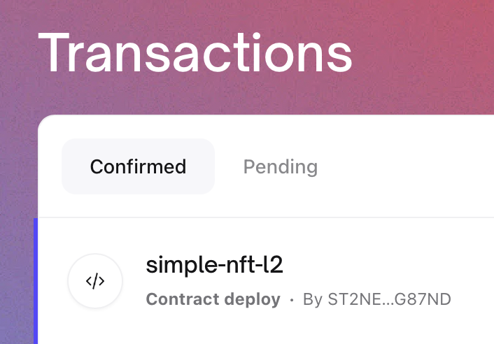

---
# The default id is the same as the one being defined below. so not needed
title: Getting Started
---

# Getting Started

Developers can test their applications on a subnet either locally, or on Hiro's
hosted testnet subnet.

- Run a local subnet
- Use the testnet subnet

> **_NOTE:_**
>
> Subnets were earlier referred to as Hyperchains. While the process of updating
> the content is ongoing, there may still be some references to hyperchains
> instead of subnets.

## Run a devnet subnet locally

Clarinet provides a tool to setup a complete local development environment,
referred to as "devnet", which uses Docker to spin up a Bitcoin node, a Stacks
node, a Stacks API node, a Stacks Explorer, and now, a subnet node and subnet
API node. This allows developers to test locally on a system that matches the
production environment.

In this section, we will explain how to launch and interact with this devnet
subnet environment using a simple NFT example project.

Make sure you have `clarinet` installed, and the clarinet version is at 1.5.0 or
above. If you do not already have clarinet installed, please refer to the
clarinet installation instructions
[here](https://github.com/hirosystems/clarinet) for installation procedures.

### Create a new project with Clarinet

To create a new project, run:

```sh
clarinet new subnet-nft-example
cd subnet-nft-example
```

This command creates a new directory with a clarinet project already
initialized, and then switches into that directory.

### Create the contracts

Clarinet does not yet fully support development on subnets, so we will not be
using it to manage our subnet contracts, but will instead do that manually for
now.

#### Creating the Stacks (L1) contract

Our L1 NFT contract is going to implement the
[SIP-009 NFT trait](https://github.com/stacksgov/sips/blob/main/sips/sip-009/sip-009-nft-standard.md#trait).
We can add this to our project as a requirement, so that Clarinet takes care of
deploying it for us.

```sh
clarinet requirements add SP2PABAF9FTAJYNFZH93XENAJ8FVY99RRM50D2JG9.nft-trait
```

Now, let's use Clarinet to create our L1 contract:

```sh
clarinet contract new simple-nft-l1
```

This will create the file, _./contracts/simple-nft-l1.clar_, which we can fill
in with the following clarity code:

```clarity
(define-constant CONTRACT_OWNER tx-sender)
(define-constant CONTRACT_ADDRESS (as-contract tx-sender))

(define-constant ERR_NOT_AUTHORIZED (err u1001))

(impl-trait 'SP2PABAF9FTAJYNFZH93XENAJ8FVY99RRM50D2JG9.nft-trait.nft-trait)
(impl-trait 'ST1PQHQKV0RJXZFY1DGX8MNSNYVE3VGZJSRTPGZGM.subnet-traits.mint-from-subnet-trait)

(define-data-var lastId uint u0)
(define-map CFG_BASE_URI bool (string-ascii 256))

(define-non-fungible-token nft-token uint)

(define-read-only (get-last-token-id)
  (ok (var-get lastId))
)

(define-read-only (get-owner (id uint))
  (ok (nft-get-owner? nft-token id))
)

(define-read-only (get-token-uri (id uint))
  (ok (map-get? CFG_BASE_URI true))
)

(define-public (transfer (id uint) (sender principal) (recipient principal))
  (begin
    (asserts! (is-eq tx-sender sender) ERR_NOT_AUTHORIZED)
    (nft-transfer? nft-token id sender recipient)
  )
)

;; test functions
(define-public (test-mint (recipient principal))
  (let
    ((newId (+ (var-get lastId) u1)))
    (var-set lastId newId)
    (nft-mint? nft-token newId recipient)
  )
)

(define-public (mint-from-subnet (id uint) (sender principal) (recipient principal))
    (begin
        ;; Check that the tx-sender is the provided sender
        (asserts! (is-eq tx-sender sender) ERR_NOT_AUTHORIZED)

        (nft-mint? nft-token id recipient)
    )
)

(define-public (gift-nft (recipient principal) (id uint))
  (begin
    (nft-mint? nft-token id recipient)
  )
)
```

Note that this contract implements the `mint-from-subnet-trait` in addition to
the SIP-009 `nft-trait`. When `mint-from-subnet-trait` is implemented, it allows
an NFT to be minted on the subnet, then later withdrawn to the L1.

#### Creating the subnet (L2) contract

Next, we'll create the subnet contract at _./contracts/simple-nft-l2.clar_. As
mentioned earlier, Clarinet cannot properly handle subnet contracts yet, so
we'll manually create this file, and add the following contents:

```clarity
(define-constant CONTRACT_OWNER tx-sender)
(define-constant CONTRACT_ADDRESS (as-contract tx-sender))

(define-constant ERR_NOT_AUTHORIZED (err u1001))

(impl-trait 'ST000000000000000000002AMW42H.subnet.nft-trait)

(define-data-var lastId uint u0)

(define-non-fungible-token nft-token uint)


;; NFT trait functions
(define-read-only (get-last-token-id)
  (ok (var-get lastId))
)

(define-read-only (get-owner (id uint))
  (ok (nft-get-owner? nft-token id))
)

(define-read-only (get-token-uri (id uint))
  (ok (some "unimplemented"))
)

(define-public (transfer (id uint) (sender principal) (recipient principal))
  (begin
    (asserts! (is-eq tx-sender sender) ERR_NOT_AUTHORIZED)
    (nft-transfer? nft-token id sender recipient)
  )
)

;; mint functions
(define-public (mint-next (recipient principal))
  (let
    ((newId (+ (var-get lastId) u1)))
    (var-set lastId newId)
    (nft-mint? nft-token newId recipient)
  )
)

(define-public (gift-nft (recipient principal) (id uint))
  (begin
    (nft-mint? nft-token id recipient)
  )
)

(define-read-only (get-token-owner (id uint))
  (nft-get-owner? nft-token id)
)

(impl-trait 'ST000000000000000000002AMW42H.subnet.subnet-asset)

;; Called for deposit from the burnchain to the subnet
(define-public (deposit-from-burnchain (id uint) (recipient principal))
  (begin
    (asserts! (is-eq tx-sender 'ST000000000000000000002AMW42H) ERR_NOT_AUTHORIZED)
    (nft-mint? nft-token id recipient)
  )
)

;; Called for withdrawal from the subnet to the burnchain
(define-public (burn-for-withdrawal (id uint) (owner principal))
  (begin
    (asserts! (is-eq tx-sender owner) ERR_NOT_AUTHORIZED)
    (nft-burn? nft-token id owner)
  )
)
```

Note that this contract implements the `nft-trait` and the `subnet-asset` trait.
The `nft-trait` is the same as the SIP-009 trait on the Stacks network.
`subnet-asset` defines the functions required for deposit and withdrawal. These
will be called by the subnet miner.

### Start the devnet

The settings for the devnet are found in _./settings/Devnet.toml_. We want to
enable a subnet node, and the corresponding API node, plus, we need to enable
"next" features, so that we can get 2.1 support, since the subnet contract
requires Clarity 2. Add (or uncomment) the following lines under `[devnet]`:

```tomml
enable_subnet_node = true
disable_subnet_api = false
enable_next_features = true
```

Run the following command to start the development environment -- launching a
bitcoin node, Stacks node, Stacks API service, subnet node, subnet API service,
and explorer service.

```sh
clarinet integrate
```

This will open a terminal UI that shows various data points about the state of
the network. We'll know that all of the nodes/services are up and ready when we
see:


Once this state is reached, we should see successful calls to `commit-block` in
the transactions console. This is the subnet miner committing blocks to the L1.
Leasve this running and perform the next steps in another terminal.

### Setup Node.js scripts

To submit transactions to our Stacks node and subnet node, we'll use
[Stacks.js](https://stacks.js.org). Let's create a new directory, _./scripts/_
for these scripts.

```sh
mkdir scripts
cd scripts
```

Then we'll initialize a Node.js project and install the stacks.js dependencies:

```sh
npm init -y
npm install @stacks/network @stacks/transactions
```

In the generated package.json file, add the following into the json to enable
modules:

```json
  "type": "module",
```

To simplify our scripts, let's define some environment variables that we can
reuse:

```sh
export DEPLOYER_ADDR=ST1PQHQKV0RJXZFY1DGX8MNSNYVE3VGZJSRTPGZGM
export DEPLOYER_KEY=753b7cc01a1a2e86221266a154af739463fce51219d97e4f856cd7200c3bd2a601

export USER_ADDR=ST2NEB84ASENDXKYGJPQW86YXQCEFEX2ZQPG87ND
export USER_KEY=f9d7206a47f14d2870c163ebab4bf3e70d18f5d14ce1031f3902fbbc894fe4c701

export ALT_USER_ADDR=ST2REHHS5J3CERCRBEPMGH7921Q6PYKAADT7JP2VB
export ALT_USER_KEY=3eccc5dac8056590432db6a35d52b9896876a3d5cbdea53b72400bc9c2099fe801
export SUBNET_URL="http://localhost:30443"
```

#### Publish contract script

First, let's define a script to publish a contract. We'll be deploying multiple
contracts, so this script takes 4 arguments to make it reusable:

1. Contract name
2. Path to contract
3. Network layer (1 = Stacks, 2 = Subnet)
4. Nonce

_publish.js_:

```js
import {
  AnchorMode,
  makeContractDeploy,
  broadcastTransaction,
} from "@stacks/transactions";
import { StacksTestnet, HIRO_MOCKNET_DEFAULT } from "@stacks/network";
import { readFileSync } from "fs";

async function main() {
  const contractName = process.argv[2];
  const contractFilename = process.argv[3];
  const networkLayer = parseInt(process.argv[4]);
  const nonce = parseInt(process.argv[5]);
  const senderKey = process.env.USER_KEY;
  const networkUrl =
    networkLayer == 2 ? process.env.SUBNET_URL : HIRO_MOCKNET_DEFAULT;

  const codeBody = readFileSync(contractFilename, { encoding: "utf-8" });

  const transaction = await makeContractDeploy({
    codeBody,
    contractName,
    senderKey,
    network: new StacksTestnet({ url: networkUrl }),
    anchorMode: AnchorMode.Any,
    fee: 10000,
    nonce,
  });

  const txid = await broadcastTransaction(
    transaction,
    new StacksTestnet({ url: networkUrl })
  );

  console.log(txid);
}

main();
```

#### Register NFT script

This script will register the NFT with the subnet, allowing it to be deposited
into the subnet and later withdrawn. We only need to do this once, so all of the
details have been hard-coded into this script. It calls
`register-new-nft-contract` on the L1 subnet contract, passing the L1 and L2 NFT
contracts we will publish.

_register.js_:

```js
import {
  makeContractCall,
  AnchorMode,
  contractPrincipalCV,
  broadcastTransaction,
  getNonce,
} from "@stacks/transactions";
import { StacksTestnet, HIRO_MOCKNET_DEFAULT } from "@stacks/network";

async function main() {
  const network = new StacksTestnet({ url: HIRO_MOCKNET_DEFAULT });
  const senderKey = process.env.DEPLOYER_KEY;
  const deployerAddr = process.env.DEPLOYER_ADDR;
  const userAddr = process.env.USER_ADDR;
  const nonce = await getNonce(deployerAddr, network);

  const txOptions = {
    contractAddress: "ST1PQHQKV0RJXZFY1DGX8MNSNYVE3VGZJSRTPGZGM",
    contractName: "subnet",
    functionName: "register-new-nft-contract",
    functionArgs: [
      contractPrincipalCV(deployerAddr, "simple-nft-l1"),
      contractPrincipalCV(userAddr, "simple-nft-l2"),
    ],
    senderKey,
    validateWithAbi: false,
    network,
    anchorMode: AnchorMode.Any,
    fee: 10000,
    nonce,
  };

  const transaction = await makeContractCall(txOptions);

  const txid = await broadcastTransaction(transaction, network);

  console.log(txid);
}

main();
```

#### Mint NFT script

This script will mint an NFT on the Stacks network. It takes one argument, to
specify the nonce.

_mint.js_:

```js
import {
  makeContractCall,
  AnchorMode,
  standardPrincipalCV,
  uintCV,
  broadcastTransaction,
} from "@stacks/transactions";
import { StacksTestnet, HIRO_MOCKNET_DEFAULT } from "@stacks/network";

async function main() {
  const network = new StacksTestnet({ url: HIRO_MOCKNET_DEFAULT });
  const senderKey = process.env.USER_KEY;
  const deployerAddr = process.env.DEPLOYER_ADDR;
  const addr = process.env.USER_ADDR;
  const nonce = parseInt(process.argv[2]);

  const txOptions = {
    contractAddress: deployerAddr,
    contractName: "simple-nft-l1",
    functionName: "gift-nft",
    functionArgs: [standardPrincipalCV(addr), uintCV(5)],
    senderKey,
    validateWithAbi: false,
    network,
    anchorMode: AnchorMode.Any,
    fee: 10000,
    nonce,
  };

  const transaction = await makeContractCall(txOptions);

  const txid = await broadcastTransaction(transaction, network);

  console.log(txid);
}

main();
```

#### Deposit NFT script

The next script calls the `deposit-nft-asset` function on the L1 subnet contract
to deposit an NFT into the subnet.

_deposit.js_

```js
import {
  makeContractCall,
  AnchorMode,
  standardPrincipalCV,
  uintCV,
  contractPrincipalCV,
  PostConditionMode,
  broadcastTransaction,
} from "@stacks/transactions";
import { StacksTestnet, HIRO_MOCKNET_DEFAULT } from "@stacks/network";

async function main() {
  const network = new StacksTestnet({ url: HIRO_MOCKNET_DEFAULT });
  const senderKey = process.env.USER_KEY;
  const addr = process.env.USER_ADDR;
  const deployerAddr = process.env.DEPLOYER_ADDR;
  const nonce = parseInt(process.argv[2]);

  const txOptions = {
    contractAddress: "ST1PQHQKV0RJXZFY1DGX8MNSNYVE3VGZJSRTPGZGM",
    contractName: "subnet",
    functionName: "deposit-nft-asset",
    functionArgs: [
      contractPrincipalCV(deployerAddr, "simple-nft-l1"), // contract ID of nft contract on L1
      uintCV(5), // ID
      standardPrincipalCV(addr), // sender
    ],
    senderKey,
    validateWithAbi: false,
    network,
    anchorMode: AnchorMode.Any,
    fee: 10000,
    postConditionMode: PostConditionMode.Allow,
    nonce,
  };

  const transaction = await makeContractCall(txOptions);

  const txid = await broadcastTransaction(transaction, network);

  console.log(txid);
}

main();
```

#### Transfer NFT script

This script calls the NFT's `transfer` function in the subnet to move it from
one principal to another. It takes one argument, to specify the nonce.

_transfer.js_

```js
import {
  makeContractCall,
  AnchorMode,
  standardPrincipalCV,
  uintCV,
  PostConditionMode,
  broadcastTransaction,
} from "@stacks/transactions";
import { StacksTestnet } from "@stacks/network";

async function main() {
  const network = new StacksTestnet({ url: process.env.SUBNET_URL });
  const senderKey = process.env.USER_KEY;
  const addr = process.env.USER_ADDR;
  const alt_addr = process.env.ALT_USER_ADDR;
  const nonce = parseInt(process.argv[2]);

  const txOptions = {
    contractAddress: addr,
    contractName: "simple-nft-l2",
    functionName: "transfer",
    functionArgs: [
      uintCV(5), // ID
      standardPrincipalCV(addr), // sender
      standardPrincipalCV(alt_addr), // recipient
    ],
    senderKey,
    validateWithAbi: false,
    network,
    anchorMode: AnchorMode.Any,
    fee: 10000,
    nonce,
    postConditionMode: PostConditionMode.Allow,
  };

  const transaction = await makeContractCall(txOptions);

  const txid = await broadcastTransaction(transaction, network);

  console.log(txid);
}

main();
```

#### L2 withdraw script

This script handles the first-part of a withdrawal, calling the `nft-withdraw?`
function on the L2 subnet contract, to initiate the withdrawal. The script takes
a single argument, to specify the nonce.

_withdraw-l2.js_

```js
import {
  makeContractCall,
  AnchorMode,
  standardPrincipalCV,
  contractPrincipalCV,
  uintCV,
  broadcastTransaction,
  PostConditionMode,
} from "@stacks/transactions";
import { StacksTestnet } from "@stacks/network";

async function main() {
  const network = new StacksTestnet({ url: process.env.SUBNET_URL });
  const senderKey = process.env.ALT_USER_KEY;
  const contractAddr = process.env.USER_ADDR;
  const addr = process.env.ALT_USER_ADDR;
  const nonce = parseInt(process.argv[2]);

  const txOptions = {
    contractAddress: "ST000000000000000000002AMW42H",
    contractName: "subnet",
    functionName: "nft-withdraw?",
    functionArgs: [
      contractPrincipalCV(contractAddr, "simple-nft-l2"),
      uintCV(5), // ID
      standardPrincipalCV(addr), // recipient
    ],
    senderKey,
    validateWithAbi: false,
    network,
    anchorMode: AnchorMode.Any,
    fee: 10000,
    nonce,
    postConditionMode: PostConditionMode.Allow,
  };

  const transaction = await makeContractCall(txOptions);

  const txid = await broadcastTransaction(transaction, network);

  console.log(txid);
}

main();
```

#### L1 withdraw script

This script handles the second part of the withdrawal, calling
`withdraw-nft-asset` on the L1 subnet contract. It takes in the withdrawal
height (from the L2 withdrawal transaction) and then fetches from the API to get
the details required to verify the withdrawal in the subnet's withdrawal tree.

It takes two arguments:

1. Withdrawal block height: this comes from the L2 withdrawal
2. Nonce

_withdraw-l1.js_

```js
import {
  makeContractCall,
  deserializeCV,
  AnchorMode,
  standardPrincipalCV,
  uintCV,
  someCV,
  PostConditionMode,
  contractPrincipalCV,
  broadcastTransaction,
} from "@stacks/transactions";
import { StacksTestnet, HIRO_MOCKNET_DEFAULT } from "@stacks/network";

async function main() {
  const network = new StacksTestnet({ url: HIRO_MOCKNET_DEFAULT });
  const subnetUrl = process.env.SUBNET_URL;
  const senderKey = process.env.ALT_USER_KEY;
  const addr = process.env.ALT_USER_ADDR;
  const contractAddr = process.env.AUTH_SUBNET_ADMIN_ADDR;
  const withdrawalBlockHeight = process.argv[2];
  const nonce = parseInt(process.argv[3]);
  const withdrawalId = 0;

  let json_merkle_entry = await fetch(
    `${subnetUrl}/v2/withdrawal/nft/${withdrawalBlockHeight}/${addr}/${withdrawalId}/${contractAddr}/simple-nft-l2/5`
  ).then((x) => x.json());
  console.log(JSON.stringify(json_merkle_entry));
  let cv_merkle_entry = {
    withdrawal_leaf_hash: deserializeCV(json_merkle_entry.withdrawal_leaf_hash),
    withdrawal_root: deserializeCV(json_merkle_entry.withdrawal_root),
    sibling_hashes: deserializeCV(json_merkle_entry.sibling_hashes),
  };

  const txOptions = {
    senderKey,
    network,
    anchorMode: AnchorMode.Any,
    contractAddress: "ST1PQHQKV0RJXZFY1DGX8MNSNYVE3VGZJSRTPGZGM",
    contractName: "subnet",
    functionName: "withdraw-nft-asset",
    functionArgs: [
      contractPrincipalCV(contractAddr, "simple-nft-l1"), // nft-contract
      uintCV(5), // ID
      standardPrincipalCV(addr), // recipient
      uintCV(withdrawalId), // withdrawal ID
      uintCV(withdrawalBlockHeight), // withdrawal block height
      someCV(contractPrincipalCV(contractAddr, "simple-nft-l1")), // nft-mint-contract
      cv_merkle_entry.withdrawal_root, // withdrawal root
      cv_merkle_entry.withdrawal_leaf_hash, // withdrawal leaf hash
      cv_merkle_entry.sibling_hashes,
    ], // sibling hashes
    fee: 10000,
    postConditionMode: PostConditionMode.Allow,
    nonce,
  };

  const transaction = await makeContractCall(txOptions);

  const txid = await broadcastTransaction(transaction, network);

  console.log(txid);
}

main();
```

#### Verify script

This final script queries the `get-owner` function to check the owner of an
asset.

_verify.js_

```js
import {
  uintCV,
  callReadOnlyFunction,
  cvToString,
  cvToHex,
  hexToCV,
} from "@stacks/transactions";
import { StacksTestnet, HIRO_MOCKNET_DEFAULT } from "@stacks/network";

async function main() {
  const networkLayer = parseInt(process.argv[2]);
  const senderAddress = process.env.ALT_USER_ADDR;
  const contractAddress =
    networkLayer == 2 ? process.env.USER_ADDR : process.env.DEPLOYER_ADDR;
  const networkUrl =
    networkLayer == 2 ? process.env.SUBNET_URL : HIRO_MOCKNET_DEFAULT;
  const network = new StacksTestnet({ url: networkUrl });
  const contractName = networkLayer == 2 ? "simple-nft-l2" : "simple-nft-l1";

  const txOptions = {
    contractAddress,
    contractName,
    functionName: "get-owner",
    functionArgs: [uintCV(5)],
    network,
    senderAddress,
  };

  const result = await callReadOnlyFunction(txOptions);

  console.log(cvToString(result.value));
}

main();
```

### Interacting with the subnet

We'll now use that set of scripts to demonstrate the subnet functionality.

First, we'll publish the L2 NFT contract to the subnet:

```sh
node ./publish.js simple-nft-l2 ../contracts/simple-nft-l2.clar 2 0
```

Clarinet's interface doesn't show the transactions on the subnet, but, we can
instead open the explorer, and see this transaction there. In a web browser,
visit http://localhost:8000. By default, it will open the explorer for the
devnet L1. To switch to the subnet, click on "Network" in the top right, then
"Add a network". In the popup, choose a name, e.g. "Devnet Subnet", then for the
URL, use "http://localhost:13999". You will know this contract deployment
succeedeed when you see the contract deploy transaction for "simple-nft-l2" in
the list of confirmed transactions.



Now that the NFT contracts are deployed to both the L1 and the L2, we can
register the NFT with the subnet.

```sh
node ./register.js
```

This is an L1 transaction, so you can watch for it in the Clarinet interface or
in the Devnet network on the explorer.

Now, we need an asset to work with, so we'll mint an NFT on the L1:

```js
node ./mint.js 0
```

Once the mint has been processed, we can deposit it into the subnet:

```js
node ./deposit.js 1
```

We can verify that the NFT is now owned by the subnet contract
(`ST1PQHQKV0RJXZFY1DGX8MNSNYVE3VGZJSRTPGZGM.subnet`) on the L1 using:

```js
node ./verify.js 1
```

Similarly, we can verify that the NFT is owned by the expected address
(`ST2NEB84ASENDXKYGJPQW86YXQCEFEX2ZQPG87ND`) on the L2:

```js
node ./verify.js 2
```

Now that the NFT is inside the subnet, we can transfer it from one address to
another:

```js
node ./transfer.js 1
```

If we call the `verify.js` script again, we should now see that the NFT is owned
by `ST2REHHS5J3CERCRBEPMGH7921Q6PYKAADT7JP2VB`.

Now, we will initiate a withdrawal from the subnet, by calling the
`nft-withdraw?` function on the L2 subnet contract.

```js
node ./withdraw-l2.js 0
```

We can confirm that this transaction is successful in the L2 explorer.

@@@@ TODO: Get the block height from somewhere easy and set the variable
`height`. @@@@

For the second part of the withdraw, we call `withdraw-nft-asset` on the L1
subnet contract:

```sh
node ./withdraw_nft_l1.js $height 0
```

This is an L1 transaction, so it can be confirmed in the L1 explorer or in the
Clarinet terminal UI.

If everything went well, now the NFT should be owned by the correct user on the
L1 (`ST2REHHS5J3CERCRBEPMGH7921Q6PYKAADT7JP2VB`):

```sh
node ./verify.js 1
```
